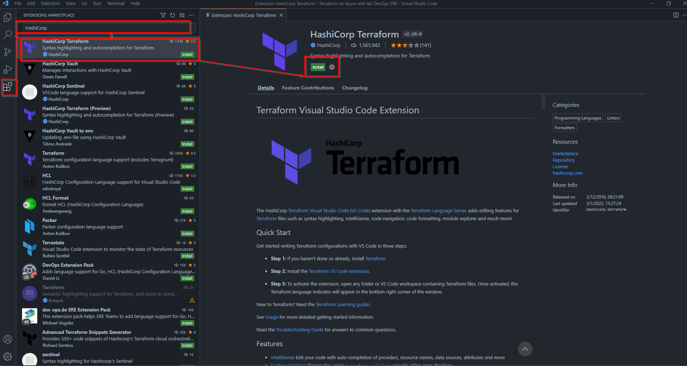

# Terraform Install Tools
This section provides some links and basic information on how to install Terraform and tools that will help creat and deploy IaC to Azure

## Install TerraFORM
This [link](https://www.terraform.io/downloads) will provide binaries and instructions on how to install the Terraform CLI for your operating system

[View](https://releases.hashicorp.com/terraform) all versions of Terraform CLI

If you already have Terraform installed and need to install the latest version you can follow this [link](https://netterminalmachine.com/blog/2021/upgrade-terraform-linux)

## Visual Studio Code
Visual Studio Code is a lightweight but powerful source code editor which runs on your desktop and is available for Windows, macOS and Linux. [Visual Studio Code](https://code.visualstudio.com/download) is free to use and help develop, manage and deploy code. 

Once VS Code has been installed, Install the HashiCorp Terraform Plugin which add editing features such as syntax highlighting, IntelliSence etc. 

1. In VS Code, Select the Extensions Icon in the left navigation 
2. In the search bar enter ***HashiCorp*** 
3. Click on HashiCorp Teraform, and click on ***Install***
   

# Git and GitHub
An important tool for implementing IaC and development in general is Source Control Management. There are a number paid and free tools to consider but the most populare are ***Git*** and ***GitHub***. You can follow the installation isntructions for Git [here](https://git-scm.com/downloads)

Click [here](https://github.com/) to register for a free GitHub account. More information on GitHub services, features and turorials can be found [here](https://docs.github.com/en/get-started)

# Azure CLI
The Azure command-line interface (Azure CLI) is a set of commands used to create and manage Azure resources. The Azure CLI is available across Azure services and is designed to get you working quickly with Azure, with an emphasis on automation.

Installation documentation can be found [here](https://docs.microsoft.com/en-us/cli/azure/install-azure-cli)

To get familair with the Azure CLI you can review the [get started with Azure CLI](https://docs.microsoft.com/en-us/cli/azure/get-started-with-azure-cli) guide.